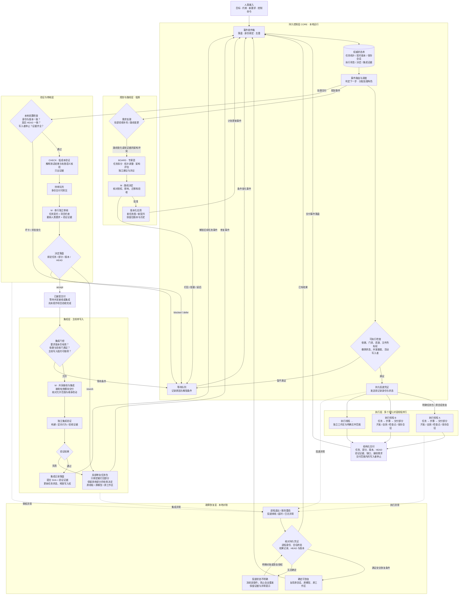

# 全自动开发流

```mermaid
flowchart TB
    HUMAN["人类输入<br/>目标 · 约束 · 新要求 · 控制命令"]

    subgraph CONTROL["持久控制层 CORE · 本地运行"]
        INBOX["事件收件箱<br/>落盘 · 身份绑定 · 去重"]
        STATE[("权威状态库<br/>任务拓扑 / 契约版本 / 保存会话<br/>执行状态 / 决定 / 集成证据")]
        ROUTER["事件路由与调度<br/>判定下一步 · 分配处理角色"]
        ELIGIBLE{"可执行检查<br/>依赖、门禁、资源、文件所有权<br/>撤销状态、并发额度、活动写入者"}
        CLAIM["持久投递凭证<br/>发送前记录身份与状态"]
        WAIT["等待队列<br/>记录原因与解锁条件"]
    
        INBOX --> STATE
        STATE --> ROUTER
        ROUTER --> ELIGIBLE
        ELIGIBLE -->|"满足"| CLAIM
        ELIGIBLE -->|"暂不满足"| WAIT
        WAIT -->|"条件变化事件"| INBOX
    end
    
    HUMAN --> INBOX
    
    subgraph PLAN["规划与路线层 · 低频"]
        NEED{"需求处理<br/>局部验收补充 / 路线变更"}
        BOARD["BOARD · 专家团<br/>任务拆分 · 拓扑调整 · 架构评估<br/>独立建议与异议"]
        PLANREVIEW["M · 路线决定<br/>核对授权、影响、迁移和验收"]
        VERSION["版本化应用<br/>新任务图 / 新契约<br/>保留旧版本与历史"]
    
        NEED -->|"路线变化或有证据的架构冲突"| BOARD
        BOARD --> PLANREVIEW
        PLANREVIEW -->|"批准"| VERSION
        PLANREVIEW -->|"打回 / 阻塞 / 延后"| WAIT
        VERSION -->|"计划更新事件"| INBOX
    end
    
    ROUTER -->|"规划事件"| NEED
    
    subgraph WORK["执行层 · 多个持久对话线程并行"]
        direction LR
        THREADA["执行线程 A<br/>任务 → 步骤 → 交付部分<br/>开发 / 自测 / 检查点 / 保存会话"]
        THREADB["执行线程 B<br/>任务 → 步骤 → 交付部分<br/>开发 / 自测 / 检查点 / 保存会话"]
        THREADN["执行线程 …<br/>独立工作区与明确文件范围"]
    end
    
    CLAIM -->|"明确任务包 / 原会话恢复"| THREADA
    CLAIM --> THREADB
    CLAIM --> THREADN
    
    THREADA --> DELIVERY
    THREADB --> DELIVERY
    THREADN --> DELIVERY
    
    DELIVERY["结构化交付<br/>任务、部分、版本、HEAD<br/>验证证据、缺口、接线需求<br/>交付范围内的写入者停止"]
    
    subgraph QUALITY["验证与审核层"]
        LOCAL{"本地前置检查<br/>身份与版本一致？<br/>真实 HEAD 一致？<br/>写入者停止？证据齐全？"}
        CHECK["CHECK · 低成本验证<br/>解释测试结果与有限语义核验<br/>只出证据"]
        REVIEWQUEUE["待审队列<br/>多份交付可积压"]
        REVIEW["M · 串行独立审核<br/>任务契约 + 项目约束<br/>最新人类要求 + 验证证据"]
        DECISION{"决定落盘<br/>绑定任务 / 部分 / 版本 / HEAD"}
    
        LOCAL -->|"通过"| CHECK
        CHECK --> REVIEWQUEUE
        REVIEWQUEUE --> REVIEW
        REVIEW --> DECISION
    end
    
    DELIVERY -->|"交付事件落盘"| INBOX
    ROUTER -->|"处理交付"| LOCAL
    LOCAL -->|"坏卡 / 状态变化"| WAIT
    
    REPAIR["局部修复任务包<br/>只绑定被打回部分<br/>保留其他部分的有效决定<br/>原线程 / 原模型 / 原工作区"]
    ACCEPTED["已接受交付<br/>等待共享接线或集成<br/>尚未视作项目验收完成"]
    
    DECISION -->|"rework"| REPAIR
    REPAIR -->|"修复事件"| INBOX
    DECISION -->|"accept"| ACCEPTED
    DECISION -->|"blocked / defer"| WAIT
    
    subgraph INTEGRATE["集成层 · 主线单写入"]
        INTEGRATIONGATE{"集成门控<br/>要求版本仍有效？<br/>依赖与验收门满足？<br/>主线写入租约可取得？"}
        WIRE["M · 共享接线与集成<br/>接收有效模块交付<br/>核对允许范围与继承改动"]
        VERIFY["独立集成验证<br/>构建 / 定向行为 / 验收证据"]
        RESULT{"验证结果"}
        COMPLETE["集成记录落盘<br/>提交 SHA + 验证证据<br/>更新任务状态、释放写入权"]
    
        INTEGRATIONGATE -->|"允许"| WIRE
        WIRE --> VERIFY
        VERIFY --> RESULT
        RESULT -->|"通过"| COMPLETE
        RESULT -->|"失败"| REPAIR
    end
    
    ACCEPTED --> INTEGRATIONGATE
    INTEGRATIONGATE -->|"等待条件"| WAIT
    COMPLETE -->|"解锁后续任务事件"| INBOX
    
    subgraph RECOVERY["故障恢复层 · 本地对账"]
        FAULT["进程退出 / 服务重启<br/>投递掉线 / 超时 / 日志异常"]
        RECONCILE{"核对持久凭证<br/>进程身份、会话终态<br/>结果记录、HEAD 与版本"}
        RECOVER["确定可恢复<br/>复用原会话、原模型、原工作区"]
        FREEZE["投递状态不明确<br/>冻结该操作，禁止自动重发<br/>保留证据与异常提示"]
    
        FAULT --> RECONCILE
        RECONCILE -->|"已有结果"| INBOX
        RECONCILE -->|"满足安全恢复条件"| RECOVER
        RECOVER --> INBOX
        RECONCILE -->|"无法确定"| FREEZE
        FREEZE -->|"明确对账或恢复授权"| RECONCILE
    end
    
    CLAIM -.->|"投递异常"| FAULT
    WORK -.->|"执行异常"| FAULT
    QUALITY -.->|"审核异常"| FAULT
    INTEGRATE -.->|"集成异常"| FAULT
    
```